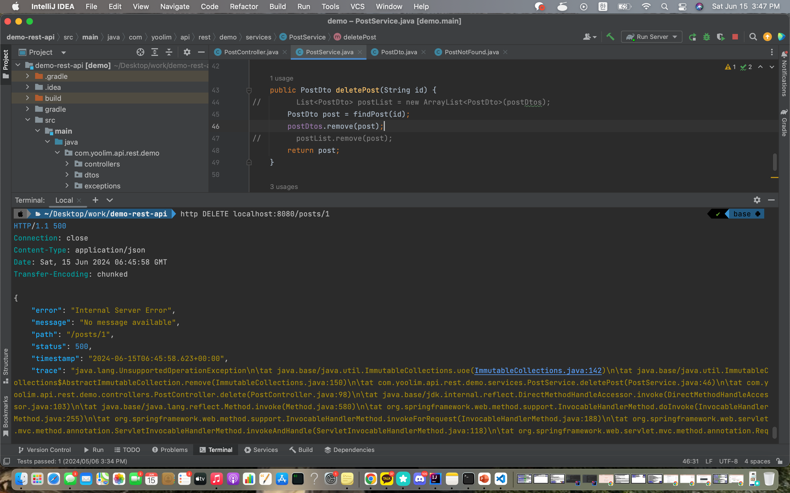

# LayeredArchitectureQuestion

Q. 안녕하세요 🙂 4주차 Layered Architecture 강의에서 post delete 하는 작업을 service로 분리하는 작업을 하면서 질문이 생겼습니다!
```
public PostDto deletePost(String id) {
PostDto post = findPost(id);
postDtos.remove(post);

return post;
}
```

다음과 같이 작성하니까
사진과 같이 unsupportedoperationexception 이 뜨더라구요ㅠㅠ


구글에 찾아보니, Arrays.asList() 메소드는 고정길이의 원배열의 list view를 리턴해서 리스트에 무언갈 추가하거나 삭제하는게 불가능하다고 나오고,
List<PostDto> postList = new ArrayList<PostDto>(postDtos);
와 같이 수정해서 삭제작업을 하면 된다고 나와있었습니다.
그렇게 하니까 오류는 안 나는데, 이렇게 하면 원본 내용은 삭제 되지 않구요...ㅎㅎ

강의 내용에서와 동일하게 작성한 것 같은데, 왜 저는 오류가 뜨는건지, 여쭤봐도 괜찮을까요? 🥲

A. 강의를 들으면서 코드 위에 계속 overwrite하는 방식으로 코드 작성을 해서 이전 코드가 없어서 이전 기억을 더듬어보면서 다시 작성하여 깃허브에 올렸습니다! 🙂
https://github.com/yoolim12/BackendSurvivalQuestion/tree/Week4-LayeredArchitecture

복구 작업을 하면서 깨달았는데 강의에서는 게시물 리스트인 postDtos 를 작성할 때
```
private List<PostDto> postDtos = new ArrayList(List.of(
new PostDto("1", "first title", "first content"),
new PostDto("2", "second title", "second content")
));
```

와 같이 작성한 반면, 제 기억상으로는 당시 저는
```
private List<PostDto> postDtos = List.of(
new PostDto("1", "first title", "first content"),
new PostDto("2", "second title", "second content")
);
```

와 같이 작성하였던 것 같습니다!

다시 해보니 new ArrayList로 감싸주니까 오류가 안 나는데, 그냥 List.of로 하게되니 동일한 오류가 나더라구요! 😄

같이 확인해주셔서 감사합니다 🙂